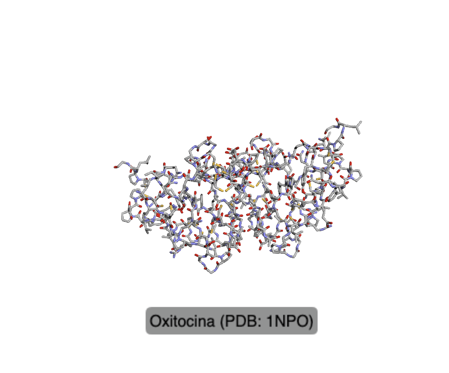
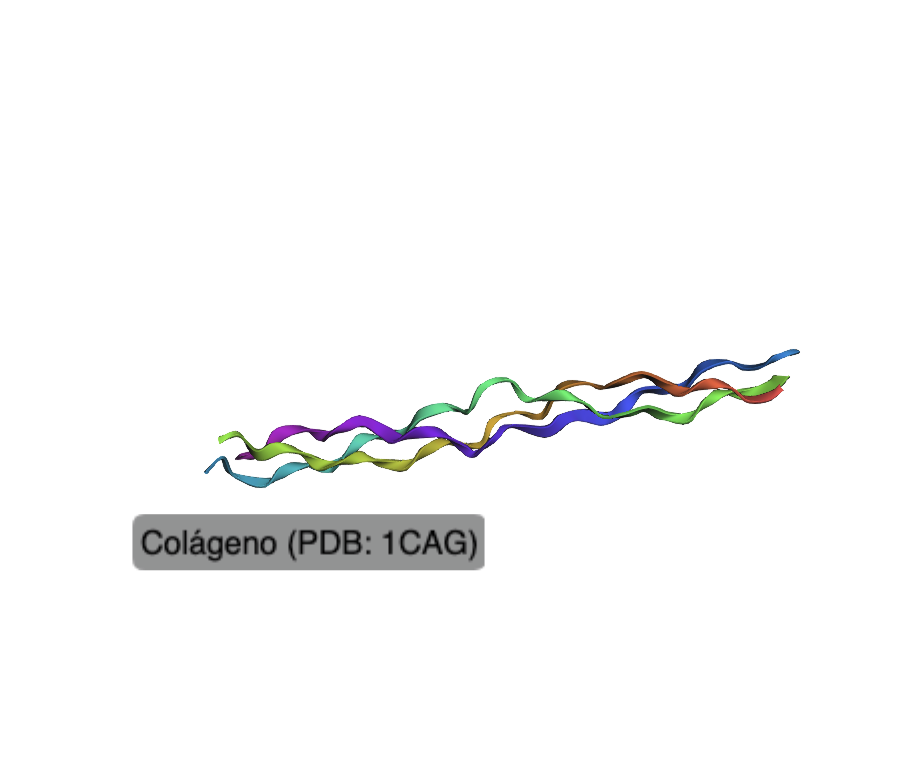
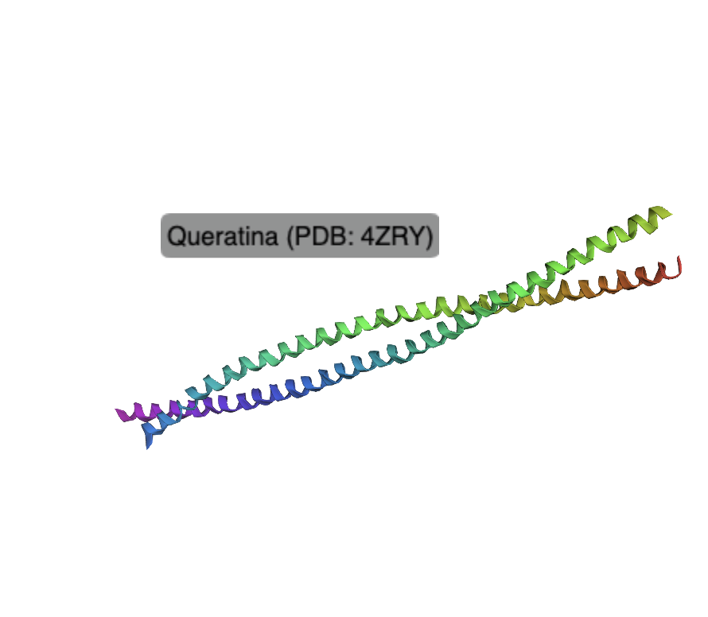

# Práctica 2: Ficheros

Pequeña práctica de bioinformática en Python dividida en dos ejercicios principales: análisis de secuencias de ADN y búsqueda/visualización de proteínas.

---

## Ejercicio 1: Análisis de secuencias de ADN

Programa en Python que:

- Lee un fichero **FASTA** con varias secuencias de ADN.
- Calcula el **porcentaje de GC** de cada secuencia y lo muestra por pantalla.
- Traduce las secuencias de **ADN a aminoácidos**.
- Guarda las secuencias traducidas en un nuevo fichero FASTA, manteniendo los identificadores originales.

### Resumen de resultados

En el notebook se exploran y visualizan los resultados mediante gráficos:

- Distribución del **porcentaje de GC** por secuencia.
- Comparación visual de las **longitudes de las secuencias**.

---

## Ejercicio 2: Búsqueda y visualización de proteínas

Trabajo de búsqueda de **3 proteínas** y sus correspondientes archivos FASTA y PDB:

- Oxitocina
- Queratina
- Colágeno

En el notebook se:

- Localizan y descargan las secuencias en formato **FASTA**.
- Añaden breves descripciones biológicas de cada proteína.
- Descargan los archivos **PDB** reales desde el Protein Data Bank.
- Visualizan las estructuras tridimensionales de los archivos PDB utilizando `py3Dmol`.

### Visualización de proteínas

A continuación se muestran las imágenes generadas a partir de los archivos PDB:

| Oxytocin | Collagen | Keratin |
|----------|----------|---------|
|  |  |  |
